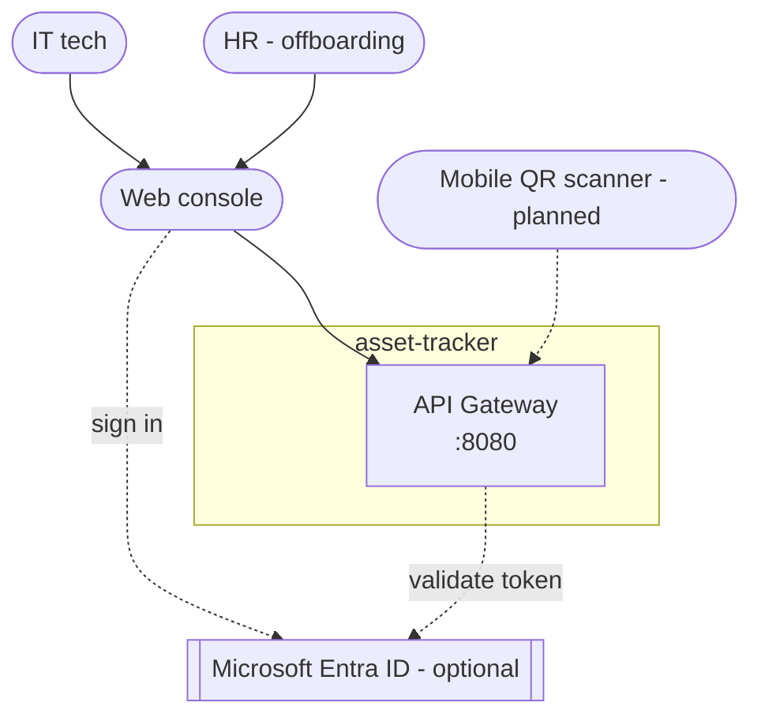
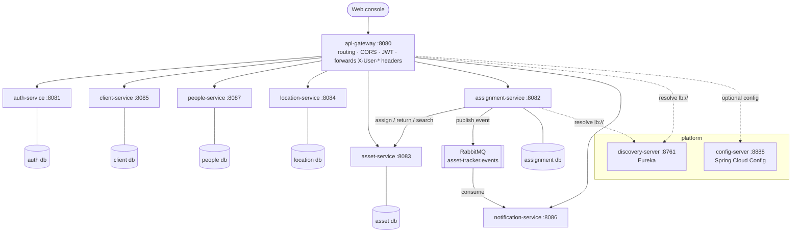
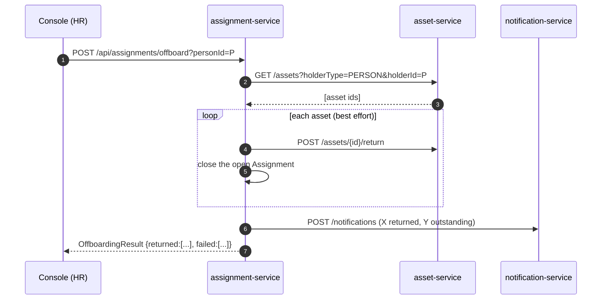

# Architecture

## 1. Context

Who uses the system and what it depends on.



- The only public entry point is the **API gateway**. Everything else is internal.
- Two kinds of user: **IT techs** (assign, transfer, repair, retire) and **HR**
  (run offboarding collection). Roles: `TECH`, `HR`, `ADMIN`.
- **Multi-tenant.** Each customer company is a *client*. Every asset, person and
  location belongs to one client; a JWT carries the set of client ids its holder
  may act on.
- Sign-in is a local account (JWT from `auth-service`) or **Microsoft Entra ID**
  when `ENTRA_ISSUER_URI` is set. The mobile QR scanner is a later milestone; the
  API is already shaped for it (`/api/**` JSON, bearer auth, `/locations/by-qr`,
  `/assets/by-tag`).

## 2. Containers

Each box is a separately deployable service with its own database.



- **Discovery** — every service registers with Eureka; the gateway and
  `assignment-service` resolve `lb://<service>` through it with client-side load
  balancing.
- **Config** — `config-server` serves shared settings from `config-repo` (native
  backend). Not load-bearing: every service ships a self-contained
  `application.yml` and imports from config-server as `optional:`.
- **Databases** — in-memory H2 by default (data resets on restart); PostgreSQL
  under the `prod` profile, one logical database per JPA service, Flyway owns the
  schema. `notification-service` has no database (in-memory list).

## 3. Checking an asset out

`assignment-service` is the orchestrator. `POST /api/assignments` fans out over HTTP.

```mermaid
sequenceDiagram
    autonumber
    participant C as Console
    participant G as api-gateway
    participant A as assignment-service
    participant S as asset-service
    participant MQ as RabbitMQ
    participant N as notification-service

    C->>G: POST /api/assignments (Bearer JWT)
    G->>G: validate token via JWKS; add X-User-Id / X-Client-Ids
    G->>A: POST /assignments
    A->>S: POST /assets/{id}/assign {holderType, holderId}<br/>(Resilience4j: retry 3x, circuit breaker)
    alt asset already ASSIGNED
        S-->>A: 409
        A-->>G: 409 ASSET_UNAVAILABLE
    else asset retired / lost / recycled
        S-->>A: 422
        A-->>G: 422 ASSET_NOT_MOVABLE
    else asset-service unreachable after retries
        A-->>G: 503 ASSET_SERVICE_UNAVAILABLE
    else free to move
        S-->>A: 200 (status ASSIGNED, holder set)
        A->>A: open Assignment row (short tx)
        A-)MQ: publish assignment.asset-checked-out (fire-and-forget)
        MQ-)N: deliver event → record notification
        A-->>G: 201 assignment {open: true}
    end
    G-->>C: response
```

**Why the persistence is split.** The flow is *not* wrapped in one
`@Transactional` — that would hold a DB connection open across the HTTP calls and
roll back the history row on a thrown failure. `AssignmentTransactions` exposes
`open` / `close` / reads, each its own short transaction; the orchestrator method
is not transactional.

## 4. Offboarding



One stuck return does not abort the sweep — the result lists what came back and
what is still out for a human to chase.

## 5. Cross-cutting

| Concern | How | Status |
|---|---|---|
| **AuthN** | JWT bearer. `auth-service` signs **RS256** tokens (`sub`, `role`, `clientIds`) and publishes its public key at `/.well-known/jwks.json`. Gateway is an OAuth2 resource server, multi-issuer (local via that JWK set, Entra when configured) - no shared secret. | working |
| **AuthZ / tenancy** | Gateway enforces "authenticated" on writes, public on `GET`, and forwards `X-User-Id` / `X-User-Role` / `X-Client-Ids` (spoof-proof). Each mutating service also re-checks: a `TenantFilter` loads `X-Client-Ids` into a `TenantContext` and write operations call `requireAllowed(clientId)` → **403** on a cross-tenant write. Absent header (public read / service-to-service) is unscoped. | working (asset / people / location / assignment) |
| **Rate limiting** | Gateway `AuthRateLimitFilter`: in-memory fixed window, 10/min per client IP on `POST /api/auth/**` → 429 + `Retry-After`. Single-instance; Redis-backed for a real deployment. | working |
| **Config** | `config-server` (native) + per-service `application.yml` + env vars. | working |
| **Persistence** | JPA. Dev: H2 + `ddl-auto: update`. `prod`: PostgreSQL, Flyway migrations, Hibernate `validate`. One DB per service. | working (local overlay) |
| **Messaging** | `assignment-service` publishes custody events to a RabbitMQ topic exchange; `notification-service` consumes them off a durable queue. HTTP `POST /notifications` kept for direct use. | working |
| **Resilience** | 2s / 3s timeouts on `assignment-service` clients; **Resilience4j** retry (3×) + circuit breaker on the `asset-service` call, 409/422 ignored, fallback → 503. Notification publish is fire-and-forget; offboarding is best-effort per asset. | working; saga compensation deferred |
| **Observability** | **Logs:** a `CorrelationIdFilter` on every service puts an `X-Correlation-Id` in the MDC for the life of a request; the gateway mints one (or keeps the client's) and forwards it — it rides outbound RestClient calls **and** the RabbitMQ hop, so one user action is greppable across every service (`logging.pattern.correlation`; `LOG_FORMAT=ecs` for Boot-native JSON). **Metrics:** every service exposes `/actuator/prometheus`; Prometheus scrapes them and Grafana ships a pre-provisioned dashboard (checkouts, offboarding runs, rate-limit hits, per-service request/5xx rate, JVM heap, circuit-breaker state). Health has liveness/readiness probe groups. | working; distributed tracing (Zipkin) deferred |
| **Lifecycle** | `server.shutdown: graceful` + 20s drain so in-flight requests finish on SIGTERM. | working |
| **API docs** | springdoc OpenAPI per service (`/swagger-ui.html`). | working |
| **Quality** | Spotless (google-java-format) + Checkstyle (cyclomatic complexity ≤ 10) + JaCoCo, applied once from the root build. | build gates working |
| **CI/CD** | One GitHub Actions workflow: Gradle build + web build + gitleaks; on `main`, a matrix publishes 10 GHCR images. | working |
| **Testing** | Unit, `@WebMvcTest`, `@DataJpaTest`, REST-Assured e2e through the gateway, and a Testcontainers IT (`PostgresProfileIT`) that runs the real `prod` Flyway + `validate` path on Postgres. | working |

## 6. Deferred — the roadmap

1. Verify a signed principal inside the mesh (mTLS / propagated JWT) instead of
   trusting the gateway's `X-*` headers at all; today services re-check the
   `X-Client-Ids` grant but still trust the header's provenance.
2. Persist / KMS-back the token-signing key so tokens survive an `auth-service` restart.
3. Saga-style compensation when an offboarding sweep half-fails.
4. Distributed tracing: a Zipkin/Tempo backend + Micrometer spans (correlation
   ids and MDC logging are in place).
5. **Visual floor map** of desks; **mobile app** that scans a desk/asset QR → what's assigned.
6. Cloud hosting: Kubernetes manifests exist (`deploy/k8s/`, Kustomize base +
   local/cloud overlays) and validate offline — see [deployment.md](deployment.md).
   Still to wire: infra-as-code for the cluster + managed PostgreSQL/broker/Key Vault,
   External Secrets Operator, HPA/PDB, a live cluster.
